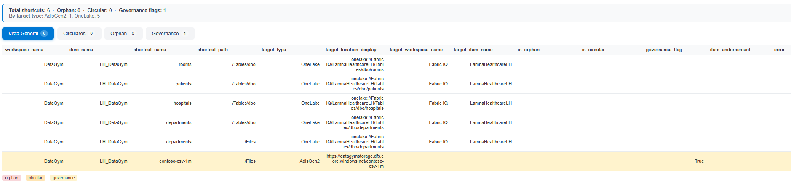

# Fabric Shortcut Inventory

> 🌐 Léelo en [Español](README.md).

A Microsoft Fabric notebook that scans workspaces and builds a **complete inventory of OneLake shortcuts**, detecting **orphaned**, **circular** and **ungoverned external** shortcuts, with an interactive HTML report and optional persistence to a Delta table.

## Why?

OneLake shortcuts are easy to create and hard to govern: over time you accumulate shortcuts pointing to deleted items, circular chains between lakehouses, and connections to external storage (S3, ADLS, GCS…) with no sensitivity label or endorsement whatsoever. Fabric offers no centralized view of any of this. This notebook builds one in a single run.

## What it does

1. **Discovers workspaces** — the entire tenant (with admin permissions) or a specific list, by name or ID.
2. **Discovers items** — lists the items in each workspace via the [Fabric REST API](https://learn.microsoft.com/rest/api/fabric/).
3. **Extracts shortcuts** — in parallel, from the item types that support them (Lakehouse, KQL Database, Mirrored Database).
4. **Parses targets** — normalizes OneLake targets (workspace/item/path) and external ones (Amazon S3, ADLS Gen2, Google Cloud Storage, S3 compatible, Dataverse, Azure Blob Storage, OneDrive/SharePoint).
5. **Validates**:
   - **Orphaned**: the target item no longer exists within the scanned scope.
   - **Circular**: shortcut chains that form a cycle (DFS detection over the dependency graph).
   - **Governance**: external shortcuts on items with no sensitivity label and no endorsement (`Certified`/`Promoted`).
6. **Resolves names** — turns target GUIDs into human-readable names, even for targets outside the scanned scope.
7. **Presents** — an interactive HTML report with 4 views (Overview, Circular, Orphan, Governance) and per-row color coding.
8. **Persists (optional)** — writes the inventory to a Delta table so you can query it with SQL or build Power BI reports on top.

## Requirements

- A **Microsoft Fabric notebook** (it uses `notebookutils`, `sempy` and `displayHTML`; it will not run outside Fabric without adaptation).
- Permissions: at minimum the **Viewer** role on the workspaces to be scanned.
  - `SCOPE_MODE = "all"` with full tenant coverage → requires a **Fabric administrator**.
  - `GOVERNANCE_CHECK = True` → requires admin (uses the `sempy` *admin scan*); if permissions are missing, it degrades gracefully instead of failing.
- For `AUTH_MODE = "sp"`: a service principal with access to the Fabric API and its secret stored in **Azure Key Vault**.

## Usage

1. Import `shortcut_inventory.ipynb` into a Fabric workspace.
2. Adjust the **parameters** cell (see the table below).
3. Run all cells in order. The HTML report appears at the end.

## Parameters

| Parameter | Values | Description |
|---|---|---|
| `SCOPE_MODE` | `"all"` \| `"list"` | `"all"` scans the whole tenant (or the accessible workspaces if you are not an admin). `"list"` limits to `WORKSPACE_LIST`. |
| `WORKSPACE_LIST` | list of `str` | Workspace names or IDs. Only with `SCOPE_MODE = "list"`. |
| `RESOLVE_NAMES` | bool | Allows using display names (in addition to GUIDs) in `WORKSPACE_LIST`. |
| `AUTH_MODE` | `"user"` \| `"sp"` | `"user"`: delegated token of the notebook user. `"sp"`: service principal (recommended for scheduled runs). |
| `SP_TENANT_ID` | GUID | Entra ID tenant (only `"sp"`). |
| `SP_CLIENT_ID` | GUID | Client ID of the app registration (only `"sp"`). |
| `SP_KEYVAULT` | URL | Key Vault where the SP secret lives — the secret is never written into the notebook. |
| `SP_SECRET_NAME` | `str` | Name of the secret in the Key Vault. |
| `GOVERNANCE_CHECK` | bool | Enriches with sensitivity/endorsement and computes `governance_flag`. |
| `SAVE_TO_DELTA` | bool | Saves the result to a Delta table (overwrite mode). |
| `DELTA_TABLE` | `str` | Name of the target Delta table. |
| `MAX_WORKERS` | int | Parallel threads for the shortcuts API. Lower it if you see throttling (429). |

## Output schema

Each inventory row is a shortcut (or a per-item extraction error):

| Column | Description |
|---|---|
| `scan_timestamp` | Scan time (UTC, ISO 8601). |
| `workspace_id` / `workspace_name` | Workspace that contains the shortcut. |
| `item_id` / `item_name` / `item_type` | Item (lakehouse, etc.) that contains the shortcut. |
| `shortcut_name` / `shortcut_path` | Name and path of the shortcut within the item. |
| `target_type` | `OneLake` or the external storage type. |
| `target_workspace_id` / `target_workspace_name` | Target workspace (OneLake only). |
| `target_item_id` / `target_item_name` | Target item (OneLake only). |
| `target_subpath` | Subpath within the target. |
| `target_location` / `target_location_display` | Target URI (with GUIDs / with readable names). |
| `is_external` | `True` if it points to storage external to OneLake. |
| `is_orphan` / `orphan_reason` | Non-existent target within the scanned scope, and the reason. |
| `is_circular` / `circular_path` | Edge that participates in a shortcut cycle. |
| `item_sensitivity_label` / `item_endorsement` | Governance metadata of the containing item. |
| `governance_flag` | External shortcut with no sensitivity and no endorsement. |
| `error` | API error while extracting the item's shortcuts, if any. |

## HTML report

The report renders inside the notebook itself, with no external dependencies:

- **Summary** with totals (shortcuts, orphaned, circular, governance flags) and a breakdown by target type.
- **Tabs**: Overview, Circular, Orphan and Governance, each with its own counter.
- **Per-row colors**: 🟥 orphaned · 🟧 circular · 🟨 governance flag.

## Known limitations

- Only **Lakehouse**, **KQLDatabase** and **MirroredDatabase** expose the shortcuts endpoint; other item types are skipped.
- Orphan detection is evaluated **against the scanned scope**: with `SCOPE_MODE = "list"`, a target living in a workspace outside the list will show up as orphaned even if it exists. For a reliable diagnosis, scan with `"all"`.
- Governance enrichment depends on the `sempy` *admin scan* and admin permissions; without them, those columns stay empty.
- Delta persistence uses `overwrite` mode; switch to `append` in the last cell if you want to keep history.

## License

[MIT](LICENSE) — free to use, modify and redistribute with attribution.
